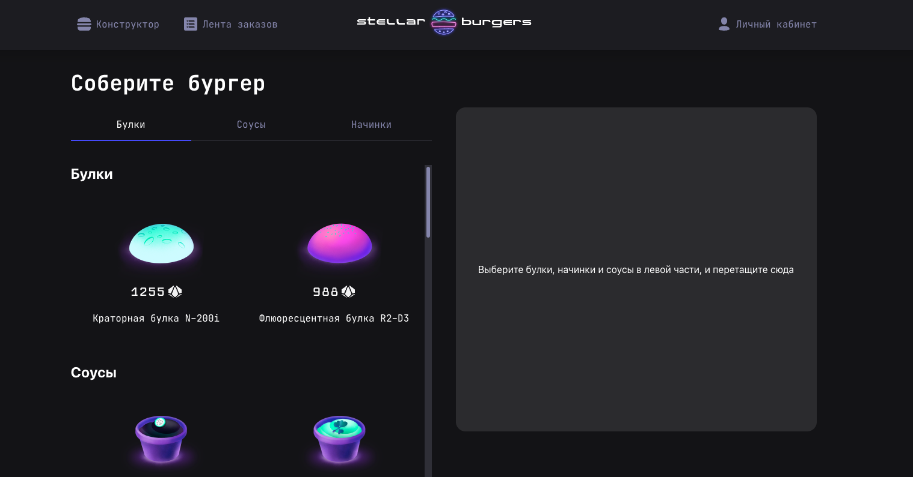

## Бургерная Яндекс-Практикум 

Проект опубликован [здесь](https://l13912.github.io/yap_burger/)

### Доступные скрипты
In the project directory, you can run:
```
npm start
```

#### Запускает приложение в режиме разработки по адресу http://localhost:3000.
```
npm run start / yarn start
```

#### Запускает юнит-тестирование
```
npm run test
```

#### Запускает тесты через cypress.
```
yarn start
yarn cypress:open
```

#### Собирает приложение для продакшена в папку build.
```
npm build
```

#### Собирает приложение в папку build и деплоит собранное приложение на gh-pages.
Ветка - gh-pages
```
npm run deploy
```
Deploy github-pages, need to change
```js
 const PUBLIC_URL: string = '/yap_burger'
```
